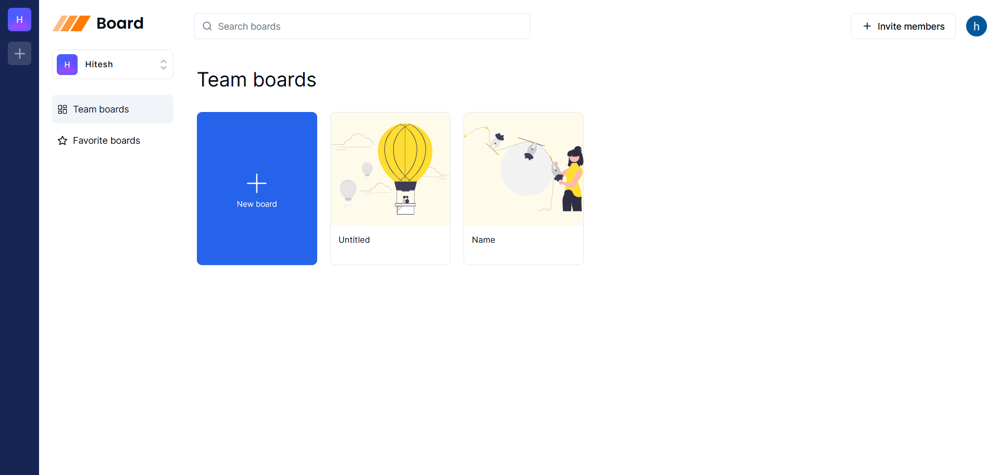
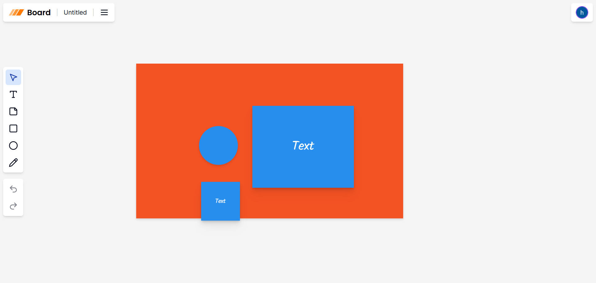

# 🧩 Miro Clone – Real-Time Collaborative Whiteboard

A modern, full-stack Miro clone that enables real-time collaborative whiteboarding. Built with Next.js and powered by Liveblocks and Convex, this application offers seamless collaboration, secure authentication, and a responsive user interface.

🔗 **Live Demo:** [https://miro-app-psi.vercel.app](https://miro-app-psi.vercel.app)

---

## 🚀 Features

- **Real-Time Collaboration:** Multiple users can interact on the same board simultaneously.
- **Interactive Whiteboard:** Draw, add shapes, and annotate in a shared space.
- **User Authentication:** Secure sign-in using Clerk's authentication system.
- **Responsive Design:** Optimized for both desktop and mobile devices.
- **Server-Side Rendering:** Enhanced performance and SEO with Next.js SSR.

---

## 🛠️ Tech Stack

**Frontend:**

- Next.js
- TypeScript
- Tailwind CSS
- ShadCN UI
- Liveblocks (Real-time collaboration)([Miro Developer Platform][5], [GitHub][6], [Stack by Convex][7], [React Projects Collection][8])

**Backend:**

- Convex (Real-time database)
- Server-Side Rendering with Next.js

**Authentication:**

- Clerk (OAuth-based authentication)

**Deployment:**

- Vercel

---

## 📸 Screenshots

### Miro Home



### Collaborative Whiteboard



---

## 🧰 Getting Started

### Prerequisites

- Node.js (v18 or higher)
- npm or yarn
- Clerk account for authentication
- Convex account for the database

### Installation

1. **Clone the repository:**

   ```bash
   git clone https://github.com/Hitesh-s0lanki/miro-app.git
   cd miro-app
   ```

2. **Install dependencies:**

   ```bash
   npm install
   # or
   yarn install
   ```

3. **Set up environment variables:**

   - Create a `.env.local` file in the root directory.
   - Refer to `.env.example` for the required environment variables.

4. **Run the development server:**

   ```bash
   npm run dev
   # or
   yarn dev
   ```

   Open [http://localhost:3000](http://localhost:3000) with your browser to see the result.

---

## ☁️ Deployment

The application is deployed on [Vercel](https://vercel.com), offering seamless integration with GitHub for continuous deployment. Every push to the `main` branch triggers an automatic deployment.

---

## 🔮 Future Enhancements

- **Enhanced Drawing Tools:** Add more shapes, colors, and line styles.
- **Board Export:** Allow users to export boards as images or PDFs.
- **Chat Integration:** Implement a chat feature for better communication.
- **Access Controls:** Introduce roles and permissions for board access.

---

## 🤝 Contributing

Contributions are welcome! Please fork the repository and submit a pull request for any enhancements or bug fixes. For major changes, please open an issue first to discuss what you would like to change.

---
